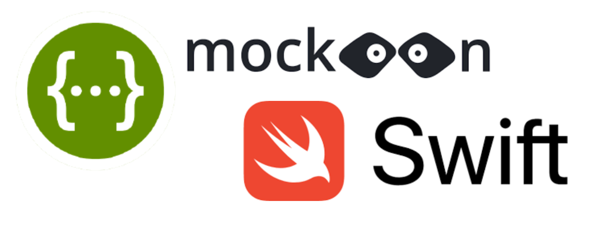
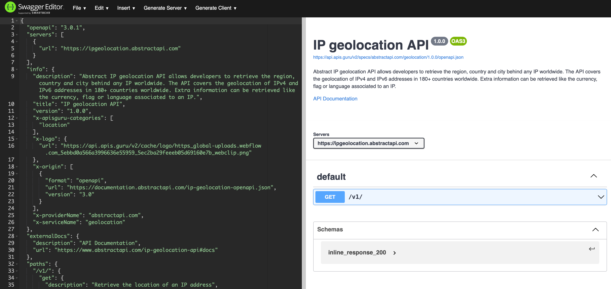
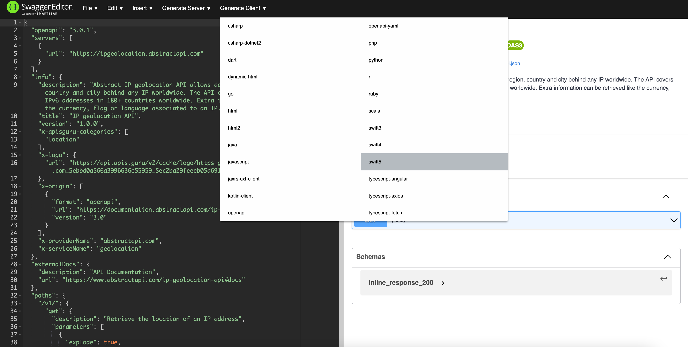
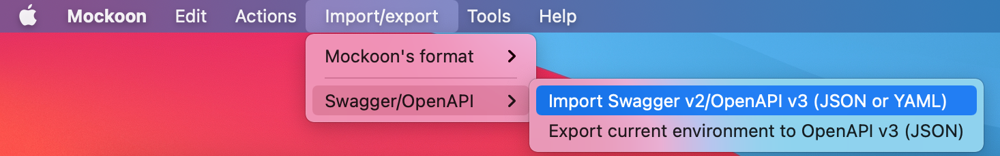
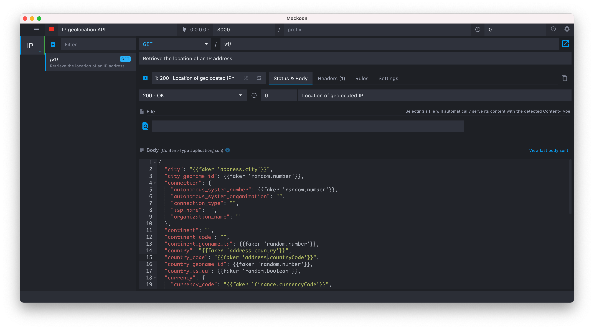
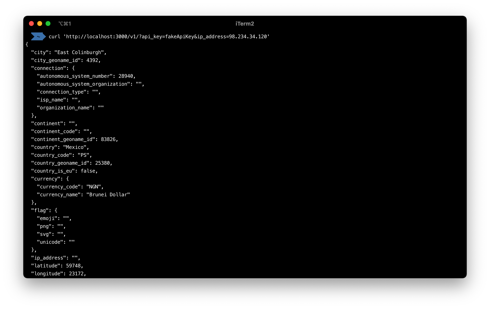

# swift-swagger-mockoon-tutorial



# Swagger





# Mockoon

## Install Mockoon

```bash
brew install --cask mockoon
```

## Import specification

`openapi.yml` 



## Start mock server



## Test mock server



# Swift

SwiftUI application `Demo/Demo.xcodeproj` using Alamofire and the [generated APIs](swift5-client-generated.zip) from Swagger Codegen
